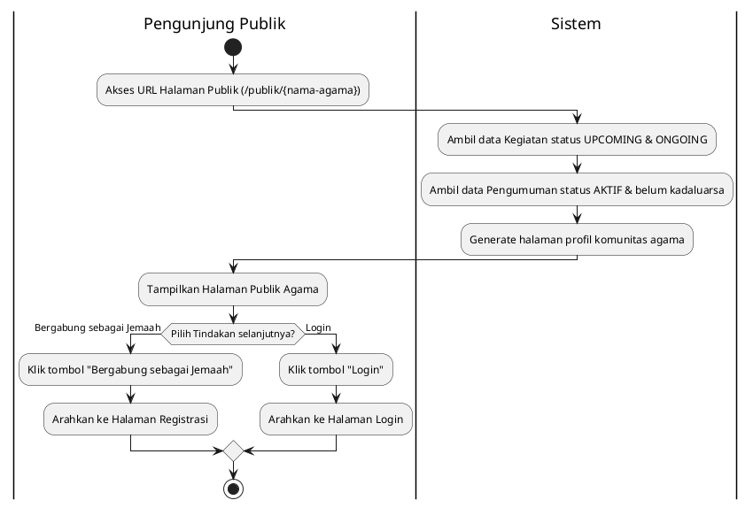

# Activity Diagram - Role: Pengunjung Publik (Tanpa Login)

Dokumen ini berisi kumpulan **Activity Diagram** untuk peran **Pengunjung Publik (Tanpa Login)** di sistem IbadahHub. Diagram digambarkan menggunakan format **PlantUML**.

## Daftar Alur Kerja (Flows)
1. [Akses Halaman Publik Tempat Ibadah](#1-akses-halaman-publik-tempat-ibadah)

---

## 1. Akses Halaman Publik Tempat Ibadah
Pengunjung publik dapat melihat profil umum komunitas keagamaan dan agenda kegiatan tanpa harus memiliki akun terlebih dahulu.

