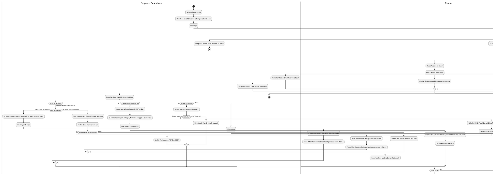

# Activity Diagram Terpadu - Role: Pengurus Bendahara (Treasurer)

Dokumen ini berisi satu **Activity Diagram Tunggal (Unified)** untuk peran **Pengurus Bendahara (Treasurer)** di sistem IbadahHub. Diagram ini menggabungkan semua fitur dan alur kerja Pengurus Bendahara dalam satu kesatuan diagram alur yang saling terhubung menggunakan format **PlantUML**.

## Diagram Alur Aktivitas Terpadu (Unified)

