# Activity Diagram Terpadu - Role: Pengurus Ketua (Head Admin)

Dokumen ini berisi satu **Activity Diagram Tunggal (Unified)** untuk peran **Pengurus Ketua (Head Admin)** di sistem IbadahHub. Diagram ini menggabungkan semua fitur dan alur kerja Pengurus Ketua dalam satu kesatuan diagram alur yang saling terhubung menggunakan format **PlantUML**.

## Diagram Alur Aktivitas Terpadu (Unified)

```plantuml
@startuml
|Pengurus Ketua|
start
:Buka Halaman Login;
:Masukkan Email & Password Pengurus Ketua;
:Klik Login;

|Sistem|
if (Akun Terkunci?) then (Ya)
  if (Waktu Kunci > 15 Menit?) then (Ya)
    :Buka Kunci & Reset Percobaan Gagal;
  else (Tidak)
    |Pengurus Ketua|
    :Tampilkan Pesan: Akun Terkunci 15 Menit;
    stop
  endif
else (Tidak)
endif

|Sistem|
if (Kredensial Cocok?) then (Ya)
  :Reset Percobaan Gagal;
  :Buat Session Token baru;
  :Arahkan ke Dashboard Pengurus (/pengurus);
  
  repeat
    |Pengurus Ketua|
    :Buka Dashboard & Pilih Menu/Aktivitas;
    if (Menu yang Dipilih?) then (Kelola Akun Pengurus)
      if (Tindakan Akun?) then (Tambah Pengurus)
        :Isi Form: Nama, Email, Sub-Role (Bendahara/Sekretaris);
        :Klik Simpan;
        |Sistem|
        :Auto-Generate Password;
        :Simpan Akun Baru ke Database;
        :Kirim Email Kredensial & Notifikasi In-App;
      elseif (Ubah Sub-Role)
        |Pengurus Ketua|
        :Pilih Pengurus & Ubah Sub-Role;
        :Klik Simpan;
        |Sistem|
        :Update subRole di database;
        :Kirim Notifikasi Perubahan Role;
      else (Nonaktifkan Pengurus)
        |Pengurus Ketua|
        :Pilih Pengurus & Klik Nonaktifkan;
        |Sistem|
        :Ubah status akun ke false (Nonaktif);
        :Kirim Notifikasi Penonaktifan;
      endif
      
    elseif (Kelola Rekening Pembayaran)
      |Pengurus Ketua|
      if (Tindakan Rekening?) then (Tambah Rekening)
        :Isi Form: Nama Bank, Nomor Rekening, Nama Pemilik, Catatan;
        :Klik Simpan;
        |Sistem|
        :Simpan data Rekening baru dengan status AKTIF;
      elseif (Edit Rekening)
        |Pengurus Ketua|
        :Pilih Rekening & Ubah Data;
        :Klik Simpan;
        |Sistem|
        :Update data Rekening di database;
      else (Ubah Status Aktif/Nonaktif)
        |Pengurus Ketua|
        :Pilih Rekening & Ubah Toggle Status;
        |Sistem|
        :Update status Rekening (AKTIF / NONAKTIF) di database;
      endif
      
    elseif (Soft Delete Lokal)
      |Pengurus Ketua|
      :Pilih Item Lokal yang ingin Dihapus;
      :Klik Hapus & Input Alasan;
      |Sistem|
      :Ubah deleted_at ke Timestamp & Simpan ke activity_logs;
      :Sembunyikan Item dari Daftar Aktif Utama;
      if (Apakah Data Donasi / Pengeluaran?) then (Ya)
        :Kurangi / Sesuaikan Perhitungan Saldo secara real-time;
      else (Tidak)
      endif
      :Pindahkan Item ke menu Arsip / Recycle Bin;
      
    elseif (Recycle Bin Lokal)
      |Pengurus Ketua|
      :Buka Menu Recycle Bin & Pilih Item;
      if (Aksi Recycle Bin?) then (Restore Data)
        :Klik Restore;
        |Sistem|
        :Ubah deleted_at kembali ke NULL;
        :Kembalikan Item ke Daftar Aktif Utama;
        if (Apakah Data Donasi / Pengeluaran?) then (Ya)
          :Sesuaikan Saldo Keuangan;
        else (Tidak)
        endif
      else (Hapus Permanen)
        |Pengurus Ketua|
        :Klik Hapus Permanen & Konfirmasi;
        |Sistem|
        if (Apakah Entitas Keuangan?) then (Ya - Donasi/Pengeluaran)
          |Pengurus Ketua|
          :Tampilkan Error: Data Keuangan tidak bisa dihapus permanen;
        else (Tidak)
          :Hard Delete Data secara Permanen dari Database;
        endif
      endif
      
    else (Logout)
      |Pengurus Ketua|
      :Klik Logout;
      |Sistem|
      :Hancurkan Session Token;
      stop
    endif
  repeat while (Tetap Login?) is (Ya)
  
else (Tidak)
  |Sistem|
  :Tambah Percobaan Gagal +1;
  if (Percobaan Gagal >= 5?) then (Ya)
    :Kunci Akun 15 Menit & Catat Log;
    |Pengurus Ketua|
    :Tampilkan Pesan: Akun dikunci sementara;
  else (Tidak)
    |Pengurus Ketua|
    :Tampilkan Pesan: Email/Password Salah;
  endif
  stop
endif
@enduml
```

