# Activity Diagram Terpadu - Role: Pengurus Sekretaris (Secretary)

Dokumen ini berisi satu **Activity Diagram Tunggal (Unified)** untuk peran **Pengurus Sekretaris (Secretary)** di sistem IbadahHub. Diagram ini menggabungkan semua fitur dan alur kerja Pengurus Sekretaris dalam satu kesatuan diagram alur yang saling terhubung menggunakan format **PlantUML**.

## Diagram Alur Aktivitas Terpadu (Unified)

```plantuml
@startuml
|Pengurus Sekretaris|
start
:Buka Halaman Login;
:Masukkan Email & Password Pengurus Sekretaris;
:Klik Login;

|Sistem|
if (Akun Terkunci?) then (Ya)
  if (Waktu Kunci > 15 Menit?) then (Ya)
    :Buka Kunci & Reset Percobaan Gagal;
  else (Tidak)
    |Pengurus Sekretaris|
    :Tampilkan Pesan: Akun Terkunci 15 Menit;
    stop
  endif
else (Tidak)
endif

|Sistem|
if (Kredensial Cocok?) then (Ya)
  :Reset Percobaan Gagal;
  :Buat Session Token baru;
  :Arahkan ke Dashboard Pengurus (/pengurus);
  
  repeat
    |Pengurus Sekretaris|
    :Buka Dashboard & Pilih Menu/Aktivitas;
    if (Menu yang Dipilih?) then (Manajemen Data Jemaah)
      if (Tindakan Jemaah?) then (Tambah Jemaah)
        :Isi Form: Nama, Email, No HP, Alamat;
        :Klik Simpan;
        |Sistem|
        :Simpan data Jemaah ke database;
        :Kirim Email Informasi Akun;
      elseif (Edit Data Jemaah)
        |Pengurus Sekretaris|
        :Pilih Jemaah & Ubah Data;
        :Klik Simpan;
        |Sistem|
        :Update data Jemaah di database;
      else (Hapus Data Jemaah)
        |Pengurus Sekretaris|
        :Pilih Jemaah & Klik Hapus;
        :Input Alasan;
        |Sistem|
        :Set deleted_at timestamp di Jemaah;
        :Simpan alasan di activity_logs;
        :Sembunyikan dari daftar jemaah aktif;
      endif
      
    elseif (Manajemen Kegiatan Ibadah)
      |Pengurus Sekretaris|
      if (Tindakan Kegiatan?) then (Tambah Kegiatan)
        :Isi Form Kegiatan & Klik Simpan;
        |Sistem|
        :Simpan Kegiatan ke Database;
        :Tentukan Status Otomatis (Upcoming/Ongoing/Selesai);
        :Kirim Notifikasi In-App ke Jemaah;
      elseif (Batalkan Kegiatan)
        |Pengurus Sekretaris|
        :Pilih Kegiatan & Klik Batalkan;
        :Input Alasan Pembatalan;
        |Sistem|
        :Ubah Status ke DIBATALKAN & Simpan Alasan;
        :Kirim Notifikasi Pembatalan ke Jemaah Terdaftar;
      else (Hapus Kegiatan - Soft Delete)
        |Pengurus Sekretaris|
        :Pilih Kegiatan & Klik Hapus;
        :Input Alasan;
        |Sistem|
        :Tandai deleted_at & Pindahkan ke Recycle Bin;
      endif
      
    elseif (Pencatatan Absensi Kehadiran)
      |Pengurus Sekretaris|
      :Buka Menu Absensi Kegiatan;
      :Pilih Kegiatan (Ongoing/Upcoming);
      :Cari Jemaah / Scan Tiket Pendaftaran;
      if (Status Kehadiran?) then (Hadir)
        |Sistem|
        :Ubah status pendaftaran menjadi HADIR;
      else if (Tidak Hadir) then (Absen)
        |Sistem|
        :Ubah status pendaftaran menjadi TIDAK_HADIR;
      else (Batal Daftar)
        |Sistem|
        :Ubah status pendaftaran menjadi BATAL;
        :Kembalikan Sisa Kapasitas Kegiatan;
      endif
      
    elseif (Manajemen Pengumuman)
      |Pengurus Sekretaris|
      :Klik Tambah Pengumuman;
      :Isi Judul, Konten Rich Text & Upload Lampiran;
      if (Pilih Simpan Sebagai?) then (Draft)
        |Sistem|
        :Sanitasi Konten HTML & Validasi Lampiran;
        :Simpan Pengumuman dengan Status DRAFT;
      else (Aktif)
        |Sistem|
        :Sanitasi Konten HTML & Validasi Lampiran;
        :Simpan Pengumuman dengan Status AKTIF;
        :Kirim Notifikasi In-App ke Jemaah;
      endif
      
    elseif (Manajemen Jadwal Ibadah)
      |Pengurus Sekretaris|
      if (Tindakan Jadwal?) then (Tambah Jadwal)
        :Isi Form: Nama Ibadah, Tanggal, Waktu, Pemimpin, Lokasi;
        :Klik Simpan;
        |Sistem|
        :Simpan JadwalIbadah ke Database;
        :Kirim Notifikasi In-App ke Jemaah;
      elseif (Edit Jadwal)
        |Pengurus Sekretaris|
        :Pilih Jadwal & Ubah Data;
        :Klik Simpan;
        |Sistem|
        :Update record JadwalIbadah;
        :Kirim Notifikasi Perubahan Jadwal ke Jemaah;
      else (Hapus Jadwal)
        |Pengurus Sekretaris|
        :Pilih Jadwal & Klik Hapus;
        |Sistem|
        :Set deleted_at timestamp di JadwalIbadah;
        :Kirim Notifikasi Pembatalan Jadwal ke Jemaah;
      endif
      
    else (Logout)
      |Pengurus Sekretaris|
      :Klik Logout;
      |Sistem|
      :Hancurkan Session Token;
      stop
    endif
  repeat while (Tetap Login?) is (Ya)
  
else (Tidak)
  |Sistem|
  :Tambah Percobaan Gagal +1;
  if (Percobaan Gagal >= 5?) then (Ya)
    :Kunci Akun 15 Menit & Catat Log;
    |Pengurus Sekretaris|
    :Tampilkan Pesan: Akun dikunci sementara;
  else (Tidak)
    |Pengurus Sekretaris|
    :Tampilkan Pesan: Email/Password Salah;
  endif
  stop
endif
@enduml
```

