# Activity Diagram Terpadu - Role: Superadmin

Dokumen ini berisi satu **Activity Diagram Tunggal (Unified)** untuk peran **Superadmin** di sistem IbadahHub. Diagram ini menggabungkan semua fitur dan alur kerja Superadmin dalam satu kesatuan diagram alur yang saling terhubung menggunakan format **PlantUML**.

## Diagram Alur Aktivitas Terpadu (Unified)

```plantuml
@startuml
|Superadmin|
start
:Buka Halaman Login;
:Masukkan Email & Password Superadmin;
:Klik Login;

|Sistem|
if (Akun Terkunci?) then (Ya)
  if (Waktu Kunci > 15 Menit?) then (Ya)
    :Buka Kunci & Reset Percobaan Gagal;
  else (Tidak)
    |Superadmin|
    :Tampilkan Pesan: Akun Terkunci 15 Menit;
    stop
  endif
else (Tidak)
endif

|Sistem|
if (Kredensial Cocok?) then (Ya)
  :Reset Percobaan Gagal;
  :Buat Session Token baru;
  :Arahkan ke Dashboard Superadmin (/admin);
  
  repeat
    |Superadmin|
    :Buka Dashboard & Pilih Menu/Aktivitas;
    if (Menu yang Dipilih?) then (Manajemen Data Agama)
      if (Pilih Tindakan Agama?) then (Tambah Agama)
        :Input Nama Agama & Deskripsi;
        :Klik Simpan;
        |Sistem|
        :Validasi Input & Cek Duplikasi Nama;
        if (Valid?) then (Ya)
          :Simpan ke tabel Religion;
          :Tampilkan Pesan Sukses;
        else (Tidak)
          |Superadmin|
          :Tampilkan Error;
        endif
      elseif (Edit Agama)
        |Superadmin|
        :Pilih Agama & Ubah Data;
        :Klik Simpan;
        |Sistem|
        :Update data di tabel Religion;
        :Tampilkan Pesan Sukses;
      else (Hapus Agama - Soft Delete)
        |Superadmin|
        :Pilih Agama & Klik Hapus;
        |Sistem|
        if (Apakah ada data aktif terkait?) then (Ya)
          |Superadmin|
          :Tampilkan Error: Agama sedang digunakan;
        else (Tidak)
          |Sistem|
          :Ubah deleted_at menjadi timestamp;
          :Tampilkan Pesan Berhasil;
        endif
      endif
      
    elseif (Kelola Pengurus Lintas Agama)
      |Superadmin|
      if (Pilih Tindakan Pengurus?) then (Tambah Pengurus)
        :Pilih Agama & Tempat Ibadah;
        :Pilih Sub-Role & Isi Form (Nama, Email, No HP);
        :Klik Simpan;
        |Sistem|
        :Auto-Generate Password;
        :Simpan Pengurus ke DB (Role: PENGURUS);
        :Kirim Email Kredensial & Akses;
      elseif (Ubah Pengurus)
        |Superadmin|
        :Pilih Pengurus & Ubah Sub-Role/Data;
        :Klik Simpan;
        |Sistem|
        :Update record User di DB;
        :Kirim Notifikasi Perubahan Akses;
      else (Hapus Pengurus - Soft Delete)
        |Superadmin|
        :Pilih Pengurus & Klik Hapus;
        :Input Alasan Penghapusan;
        |Sistem|
        :Set deleted_at timestamp di tabel User;
        :Simpan alasan ke activity_logs;
      endif
      
    elseif (Monitoring Dashboard)
      |Superadmin|
      :Akses Halaman Dashboard Utama;
      |Sistem|
      :Ambil Data Statistik Global;
      |Superadmin|
      :Lihat Ringkasan Lintas Agama;
      if (Ingin Memfilter Data?) then (Ya)
        :Pilih Filter Agama (religionId);
        |Sistem|
        :Query data Dashboard sesuai filter;
        |Superadmin|
        :Tampilkan Grafik & Laporan Kas Terfilter;
      else (Tidak)
      endif
      
    elseif (Monitoring Audit Trail)
      |Superadmin|
      :Buka Menu Audit Trail;
      if (Pilih Jenis Log?) then (Log Login)
        :Akses Halaman Log Login;
        |Sistem|
        :Query tabel login_logs;
      else (Log Aktivitas CRUD)
        |Superadmin|
        :Akses Halaman Log Aktivitas;
        |Sistem|
        :Query tabel activity_logs;
      endif
      |Superadmin|
      :Filter Log (Waktu/Aktor/Agama);
      :Tinjau Riwayat Aktivitas & Perubahan Data;
      
    elseif (Global Recycle Bin / Arsip)
      |Superadmin|
      :Buka Halaman Global Recycle Bin;
      :Pilih Kategori Entitas & Pilih Item;
      if (Pilih Aksi Recycle Bin?) then (Restore)
        :Klik Restore Data;
        |Sistem|
        :Ubah deleted_at menjadi NULL;
        :Kembalikan ke Daftar Aktif Utama;
        if (Entitas Keuangan?) then (Ya)
          :Hitung Kembali Saldo Kas Agama;
        else (Tidak)
        endif
      else (Hapus Permanen - Hard Delete)
        |Superadmin|
        :Klik Hapus Permanen;
        |Sistem|
        if (Apakah Entitas Keuangan?) then (Ya - Donasi/Pengeluaran)
          |Superadmin|
          :Tampilkan Error: Data Keuangan tidak bisa dihapus permanen;
        else (Tidak)
          |Sistem|
          :Hard Delete Data dari Database;
        endif
      endif
      
    else (Logout)
      |Superadmin|
      :Klik Logout;
      |Sistem|
      :Hancurkan Session Token;
      stop
    endif
  repeat while (Tetap Login?) is (Ya)
  
else (Tidak)
  |Sistem|
  :Tambah Percobaan Gagal +1;
  if (Percobaan Gagal >= 5?) then (Ya)
    :Kunci Akun 15 Menit & Catat Log;
    |Superadmin|
    :Tampilkan Pesan: Akun dikunci sementara;
  else (Tidak)
    |Superadmin|
    :Tampilkan Pesan: Email/Password Salah;
  endif
  stop
endif
@enduml
```

