# Activity Diagrams - IbadahHub (v3.0 - Fully Self-Contained)

Dokumen ini berisi kumpulan **Activity Diagram** dalam format **PlantUML** menggunakan layout **Swimlane** yang **dipisahkan secara terstruktur berdasarkan peran (Role) dan fitur** masing-masing pengguna di sistem IbadahHub.

Setiap peran kini memiliki diagram alur login, keamanan brute-force, dan aksi fungsional secara lengkap dan mandiri tanpa rujukan silang, demi mencapai dokumentasi yang **se-lengkap-lengkapnya**.

---

## 1. Role: Superadmin

Superadmin memiliki hak akses global untuk mengelola seluruh data lintas agama, memantau audit trail, dan mengelola akun ketua pengurus tempat ibadah.

### 1.1 Fitur: Login & Keamanan Brute Force (Superadmin)
Sistem membatasi kegagalan login hingga 5 kali sebelum melakukan penguncian otomatis selama 15 menit demi keamanan data Superadmin.

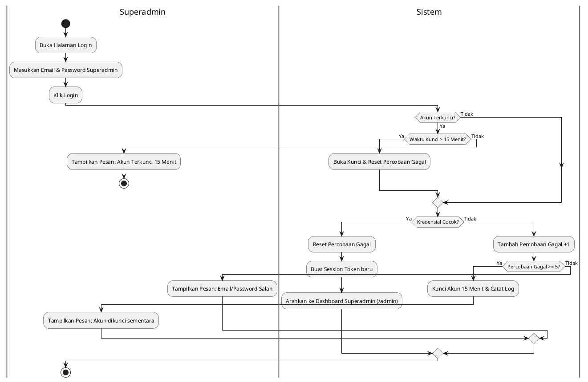

### 1.2 Fitur: Manajemen Data Agama (Religion CRUD)

#### 1.2.1 Tambah Agama Baru
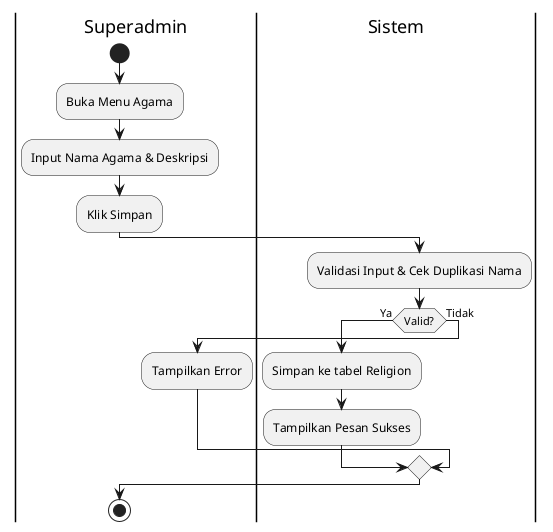

#### 1.2.2 Edit Data Agama
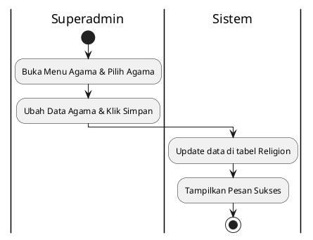

#### 1.2.3 Hapus Data Agama (Soft Delete)
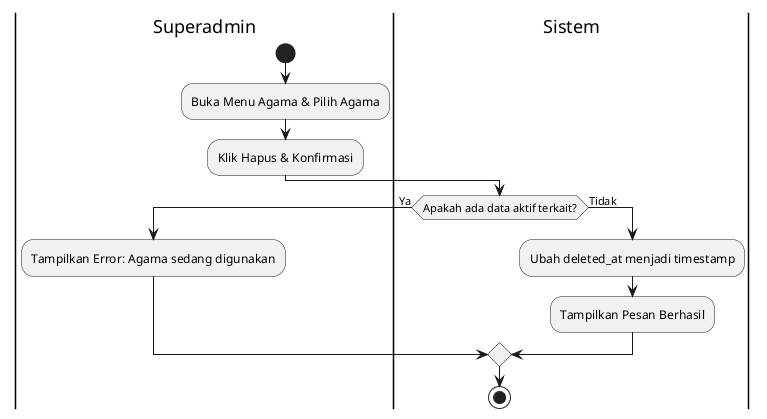

---

### 1.3 Fitur: Mengelola Akun Pengurus Lintas Agama (Ketua, Bendahara, Sekretaris)

#### 1.3.1 Tambah Pengurus Lintas Agama
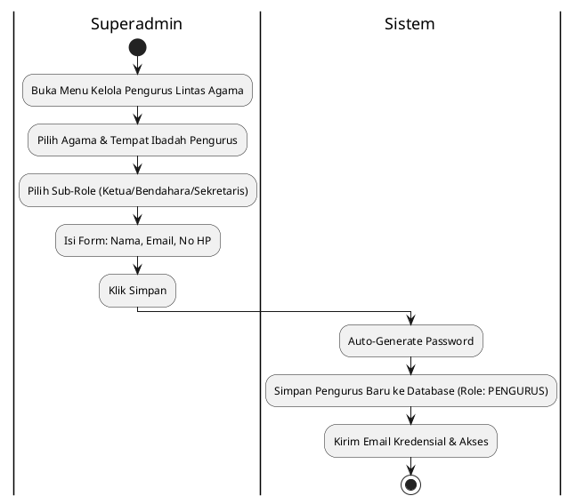

#### 1.3.2 Ubah Sub-Role / Data Pengurus Lintas Agama
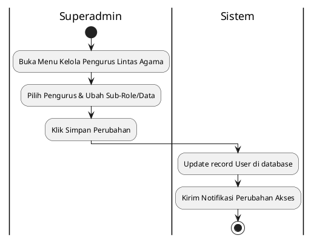

#### 1.3.3 Hapus Pengurus Lintas Agama (Soft Delete)
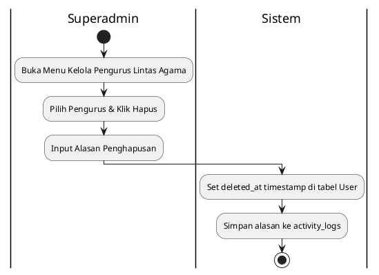

---

### 1.4 Fitur: Monitoring Dashboard & Filter Lintas Agama
Superadmin dapat melihat rangkuman statistik data keuangan dan kegiatan secara menyeluruh dengan opsi filter berdasarkan agama.

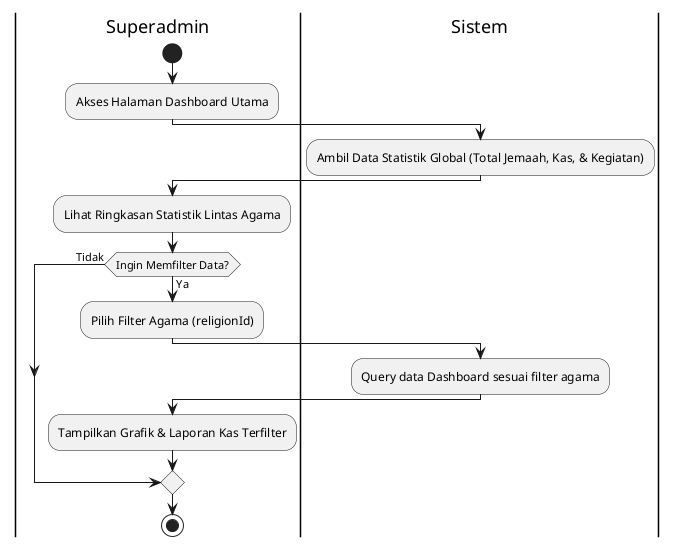

---

### 1.5 Fitur: Monitoring Audit Trail & Log Aktivitas
Superadmin dapat memantau setiap log masuk serta rekam jejak aksi modifikasi data yang terjadi di seluruh sistem.

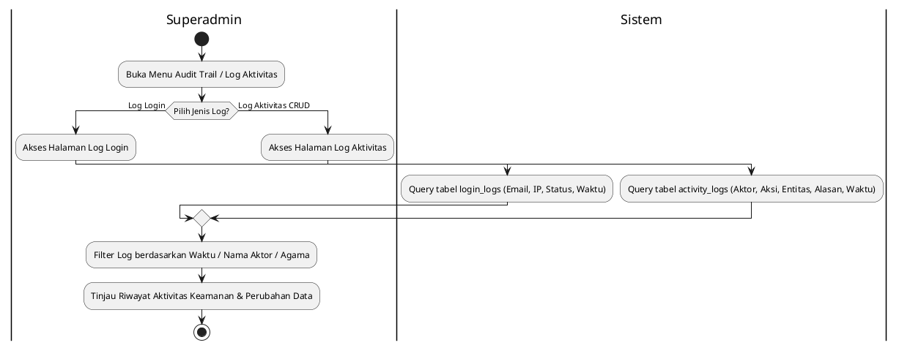

---

### 1.6 Fitur: Global Recycle Bin (Restore & Hard Delete)
Superadmin memiliki akses khusus untuk merestore data apa pun yang terhapus logis, serta melakukan hapus permanen (hard delete) khusus untuk data non-keuangan.

#### 1.6.1 Pemulihan Data Global (Restore)
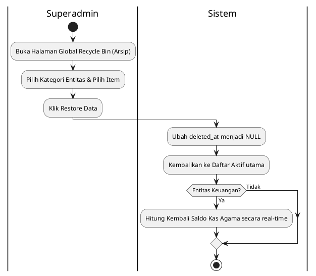

#### 1.6.2 Hapus Permanen Global (Hard Delete)
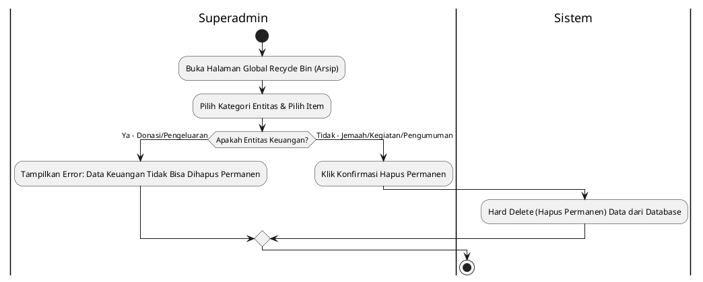

---

## 2. Role: Pengurus Ketua (Head Admin)

Pengurus Ketua memiliki hak akses penuh dalam lingkup agama yang ia kelola, termasuk manajemen pengurus di bawahnya, rekening pembayaran, dan pemulihan data lokal.

### 2.1 Fitur: Login & Keamanan Brute Force (Pengurus Ketua)
Sistem membatasi kegagalan login hingga 5 kali sebelum melakukan penguncian otomatis selama 15 menit demi keamanan data Pengurus Ketua.


---

### 2.2 Fitur: Manajemen Akun Pengurus (Bendahara & Sekretaris)

#### 2.2.1 Tambah Pengurus Baru
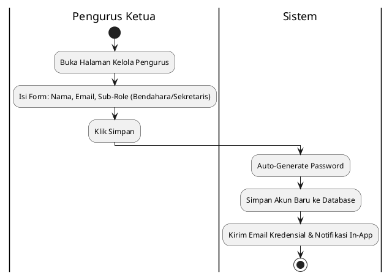

#### 2.2.2 Ubah Sub-Role Pengurus
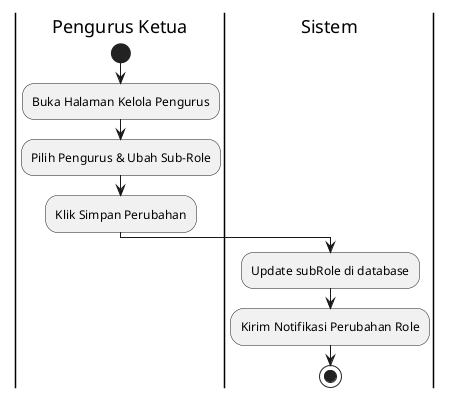

#### 2.2.3 Menonaktifkan Akun Pengurus
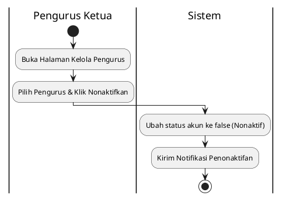

---

### 2.3 Fitur: Mengelola Rekening Pembayaran Agama

#### 2.3.1 Tambah Rekening Resmi
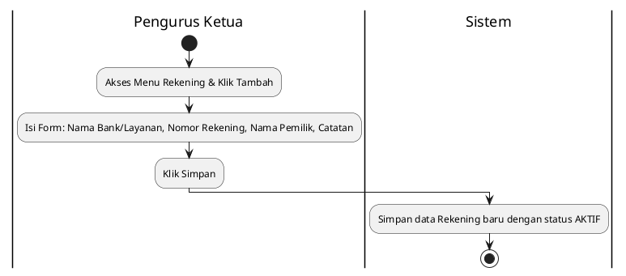

#### 2.3.2 Edit Rekening
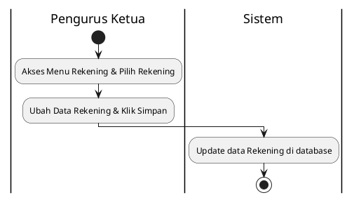

#### 2.3.3 Ubah Status Aktif/Nonaktif Rekening
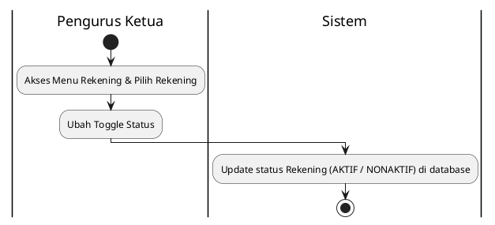

---

## 3. Role: Pengurus Bendahara (Treasurer)

Bendahara fokus pada pengelolaan finansial, mencatat donasi masuk, iuran kas, memproses pengeluaran, dan menyusun laporan keuangan tempat ibadah.

### 3.1 Fitur: Login & Keamanan Brute Force (Pengurus Bendahara)
Sistem membatasi kegagalan login hingga 5 kali sebelum melakukan penguncian otomatis selama 15 menit demi keamanan data Pengurus Bendahara.

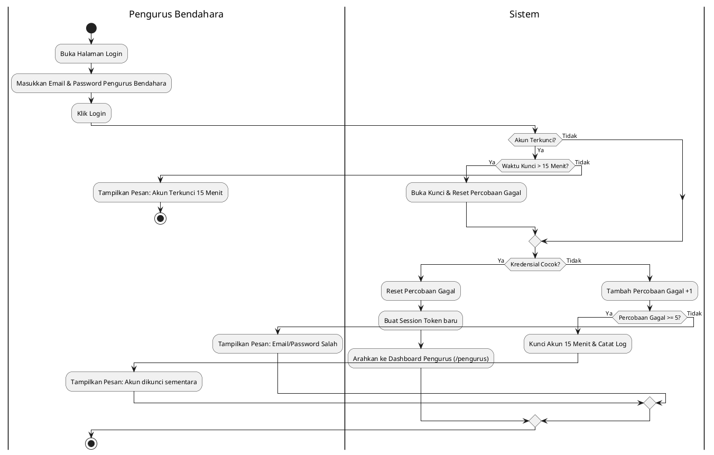

---

### 3.2 Fitur: Verifikasi & Pencatatan Donasi (Transfer & Tunai)
Memproses verifikasi transfer jemaah (Pending ➔ Dikonfirmasi/Ditolak) atau mencatat donasi tunai secara instan (otomatis langsung berstatus Dikonfirmasi).

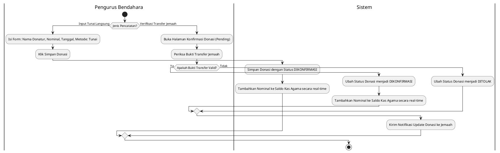

---

### 3.3 Fitur: Pencatatan Pengeluaran Kas (Expenses)
Mencatat pengeluaran kas tempat ibadah beserta lampiran nota/bukti keluar kas untuk validasi keuangan.

```plantuml
@startuml
|Pengurus Bendahara|
start
:Masuk Menu Pengeluaran & Klik Tambah;
:Isi Form: Keterangan, Kategori, Nominal, Tanggal & Bukti Nota;
:Klik Simpan Pengeluaran;

|Sistem|
:Simpan Pengeluaran & Kurangi Saldo Kas secara real-time;
:Tampilkan Pesan Berhasil;
stop
@enduml
```

---

### 3.4 Fitur: Pemantauan & Ekspor Laporan Keuangan
Melihat ringkasan grafik kas, rincian per kategori, dan melakukan ekspor laporan kas ke berkas PDF atau Excel/CSV.

```plantuml
@startuml
|Pengurus Bendahara|
start
:Akses Halaman Laporan Keuangan;
if (Pilih Aksi?) then (Ekspor Laporan)
  |Sistem|
  :Kalkulasi Saldo: Total Donasi Dikonfirmasi - Total Pengeluaran Aktif;
  :Generate File Laporan Keuangan;
  |Pengurus Bendahara|
  :Unduh File Laporan (PDF/Excel/CSV);
else (Lihat Visualisasi)
  |Pengurus Bendahara|
  :Lihat Grafik Tren & Detail Kategori;
endif
stop
@enduml
```

---

## 4. Role: Pengurus Sekretaris (Secretary)

Sekretaris mengelola data jemaah, administrasi kegiatan, pencatatan absensi, pengumuman berita, dan penjadwalan ibadah rutin.

### 4.1 Fitur: Login & Keamanan Brute Force (Pengurus Sekretaris)
Sistem membatasi kegagalan login hingga 5 kali sebelum melakukan penguncian otomatis selama 15 menit demi keamanan data Pengurus Sekretaris.

```plantuml
@startuml
|Pengurus Sekretaris|
start
:Buka Halaman Login;
:Masukkan Email & Password Pengurus Sekretaris;
:Klik Login;

|Sistem|
if (Akun Terkunci?) then (Ya)
  if (Waktu Kunci > 15 Menit?) then (Ya)
    :Buka Kunci & Reset Percobaan Gagal;
  else (Tidak)
    |Pengurus Sekretaris|
    :Tampilkan Pesan: Akun Terkunci 15 Menit;
    stop
  endif
else (Tidak)
endif

|Sistem|
if (Kredensial Cocok?) then (Ya)
  :Reset Percobaan Gagal;
  :Buat Session Token baru;
  :Arahkan ke Dashboard Pengurus (/pengurus);
else (Tidak)
  :Tambah Percobaan Gagal +1;
  if (Percobaan Gagal >= 5?) then (Ya)
    :Kunci Akun 15 Menit & Catat Log;
    |Pengurus Sekretaris|
    :Tampilkan Pesan: Akun dikunci sementara;
  else (Tidak)
    |Pengurus Sekretaris|
    :Tampilkan Pesan: Email/Password Salah;
  endif
endif
stop
@enduml
```

---

### 4.2 Fitur: Manajemen Data Jemaah (Manual & Soft Delete)

#### 4.2.1 Tambah Jemaah Manual
```plantuml
@startuml
|Pengurus Sekretaris|
start
:Akses Menu Jemaah & Klik Tambah;
:Isi Form: Nama, Email, No HP, Alamat;
:Klik Simpan;
|Sistem|
:Simpan data Jemaah ke database;
:Kirim Email Informasi Akun;
stop
@enduml
```

#### 4.2.2 Edit Data Jemaah
```plantuml
@startuml
|Pengurus Sekretaris|
start
:Akses Menu Jemaah & Pilih Jemaah;
:Ubah Data Jemaah & Klik Simpan;
|Sistem|
:Update data Jemaah di database;
stop
@enduml
```

#### 4.2.3 Hapus Data Jemaah (Soft Delete)
```plantuml
@startuml
|Pengurus Sekretaris|
start
:Akses Menu Jemaah & Pilih Jemaah;
:Klik Hapus & Input Alasan;
|Sistem|
:Set deleted_at timestamp di Jemaah;
:Simpan alasan di activity_logs;
:Sembunyikan dari daftar jemaah aktif;
stop
@enduml
```

---

### 4.3 Fitur: Manajemen Kegiatan Ibadah (Activity CRUD)

#### 4.3.1 Tambah Kegiatan Baru
```plantuml
@startuml
|Pengurus Sekretaris|
start
:Akses Menu Kegiatan & Klik Tambah;
:Isi Form Kegiatan & Klik Simpan;
|Sistem|
:Simpan Kegiatan ke Database;
:Tentukan Status Otomatis (Upcoming/Ongoing/Selesai);
:Kirim Notifikasi In-App ke Jemaah sealiran;
stop
@enduml
```

#### 4.3.2 Batalkan Kegiatan
```plantuml
@startuml
|Pengurus Sekretaris|
start
:Akses Menu Kegiatan & Pilih Kegiatan;
:Klik Batalkan & Input Alasan Pembatalan;
|Sistem|
:Ubah Status ke DIBATALKAN & Simpan Alasan;
:Kirim Notifikasi Pembatalan ke Jemaah Terdaftar;
stop
@enduml
```

#### 4.3.3 Hapus Kegiatan (Soft Delete)
```plantuml
@startuml
|Pengurus Sekretaris|
start
:Akses Menu Kegiatan & Pilih Kegiatan;
:Klik Hapus Kegiatan & Input Alasan;
|Sistem|
:Tandai deleted_at & Pindahkan ke Recycle Bin;
stop
@enduml
```

---

### 4.4 Fitur: Pencatatan Absensi / Kehadiran Kegiatan
Pengurus dapat menandai kehadiran jemaah yang telah terdaftar pada suatu kegiatan ibadah.

```plantuml
@startuml
|Pengurus Sekretaris|
start
:Buka Menu Absensi Kegiatan;
:Pilih Kegiatan yang Sedang Berjalan (Ongoing/Upcoming);
:Cari Nama Jemaah / Scan Tiket Pendaftaran;
if (Status Kehadiran?) then (Hadir)
  |Sistem|
  :Ubah status pendaftaran menjadi HADIR;
else if (Tidak Hadir) then (Absen)
  |Sistem|
  :Ubah status pendaftaran menjadi TIDAK_HADIR;
else (Batal Daftar)
  |Sistem|
  :Ubah status pendaftaran menjadi BATAL;
  :Kembalikan Sisa Kapasitas Kegiatan;
endif
stop
@enduml
```

---

### 4.5 Fitur: Manajemen Pengumuman (Rich Text & Lampiran)
Membuat pengumuman berita/informasi keagamaan dengan rich text editor dan maksimal 3 berkas lampiran (PDF/Gambar, max 5MB).

```plantuml
@startuml
|Pengurus Sekretaris|
start
:Akses Menu Pengumuman;
:Klik Tambah Pengumuman;
:Isi Judul, Konten via Rich Text, Upload Lampiran;
if (Pilih Simpan Sebagai?) then (Draft)
  |Sistem|
  :Sanitasi Konten HTML & Validasi Lampiran;
  :Simpan Pengumuman dengan Status DRAFT;
else (Aktif)
  |Sistem|
  :Sanitasi Konten HTML & Validasi Lampiran;
  :Simpan Pengumuman dengan Status AKTIF;
  :Kirim Notifikasi In-App ke Jemaah sealiran;
endif
stop
@enduml
```

---

### 4.6 Fitur: Manajemen Jadwal Ibadah

#### 4.6.1 Tambah Jadwal Ibadah
```plantuml
@startuml
|Pengurus Sekretaris|
start
:Akses Menu Jadwal Ibadah & Klik Tambah;
:Isi Form: Nama Ibadah, Tanggal, Waktu Mulai/Selesai, Pemimpin, Pendamping, Lokasi, Catatan;
:Klik Simpan;
|Sistem|
:Simpan JadwalIbadah ke Database;
:Kirim Notifikasi In-App ke Jemaah sealiran;
stop
@enduml
```

#### 4.6.2 Edit / Hapus Jadwal Ibadah
```plantuml
@startuml
|Pengurus Sekretaris|
start
:Akses Menu Jadwal Ibadah & Pilih Jadwal;
if (Pilih Aksi?) then (Edit Jadwal)
  :Ubah Data Jadwal & Klik Simpan;
  |Sistem|
  :Update record JadwalIbadah;
  :Kirim Notifikasi Perubahan Jadwal ke Jemaah;
else (Hapus Jadwal)
  |Pengurus Sekretaris|
  :Klik Hapus Jadwal;
  |Sistem|
  :Set deleted_at timestamp di JadwalIbadah;
  :Kirim Notifikasi Pembatalan Jadwal ke Jemaah;
endif
stop
@enduml
```

---

## 5. Role: Jemaah (Congregation Member)

Jemaah merupakan pengguna terdaftar yang dapat mendaftar kegiatan, melakukan donasi (manual/otomatis), membayar tagihan kas, dan mengelola akun pribadinya.

### 5.1 Fitur: Login & Keamanan Brute Force (Jemaah)
Sistem membatasi kegagalan login hingga 5 kali sebelum melakukan penguncian otomatis selama 15 menit demi keamanan data Jemaah.

```plantuml
@startuml
|Jemaah|
start
:Buka Halaman Login;
:Masukkan Email & Password Jemaah;
:Klik Login;

|Sistem|
if (Akun Terkunci?) then (Ya)
  if (Waktu Kunci > 15 Menit?) then (Ya)
    :Buka Kunci & Reset Percobaan Gagal;
  else (Tidak)
    |Jemaah|
    :Tampilkan Pesan: Akun Terkunci 15 Menit;
    stop
  endif
else (Tidak)
endif

|Sistem|
if (Kredensial Cocok?) then (Ya)
  :Reset Percobaan Gagal;
  :Buat Session Token baru;
  :Arahkan ke Dashboard Jemaah (/dashboard);
else (Tidak)
  :Tambah Percobaan Gagal +1;
  if (Percobaan Gagal >= 5?) then (Ya)
    :Kunci Akun 15 Menit & Catat Log;
    |Jemaah|
    :Tampilkan Pesan: Akun dikunci sementara;
  else (Tidak)
    |Jemaah|
    :Tampilkan Pesan: Email/Password Salah;
  endif
endif
stop
@enduml
```

---

### 5.2 Fitur: Registrasi Mandiri & Verifikasi Akun
Jemaah mendaftarkan akunnya secara mandiri, memilih agama dan tempat ibadahnya, serta memverifikasi via email.

```plantuml
@startuml
|Jemaah|
start
:Buka Halaman Registrasi;
:Input Nama, Email, Password, & Konfirmasi Password;
:Pilih Agama (religionId);

|Sistem|
:Ambil Daftar Tempat Ibadah berdasarkan Agama yang Dipilih;

|Jemaah|
:Pilih Tempat Ibadah (tempatIbadahId);
:Input Nomor HP & Alamat (opsional);
:Klik Daftar Sekarang;

|Sistem|
:Validasi Data Form (Zod Schema) & Konfirmasi Password;
if (Form Valid?) then (Ya)
  :Cek Keunikan Email di Database;
  if (Email Belum Terdaftar?) then (Ya)
    :Simpan Akun Jemaah dengan status Nonaktif;
    :Generate Verification Token (Masa Berlaku 24 Jam);
    :Kirim Email Verifikasi (Link Verifikasi);
    |Jemaah|
    :Tampilkan Layar "Akun Berhasil Dibuat" & Cek Inbox;
    if (Email Verifikasi Diterima?) then (Ya)
      :Buka Email & Klik Link Verifikasi;
      |Sistem|
      if (Link Valid & Belum Kedaluwarsa?) then (Ya)
        :Ubah Status Akun Jemaah menjadi Aktif;
        |Jemaah|
        :Tampilkan Pesan Verifikasi Sukses;
        :Masuk ke Halaman Login & Login ke Sistem;
        stop
      else (Tidak)
        |Jemaah|
        :Tampilkan Error: Link Kedaluwarsa;
        :Klik tombol "Kirim Ulang Email Verifikasi";
        |Sistem|
        :Kirim Ulang Email Verifikasi;
        |Jemaah|
        :Cek Inbox / Folder Spam Kembali;
        stop
      endif
    else (Tidak / Link Belum Diterima)
      :Klik tombol "Kirim Ulang Email Verifikasi";
      |Sistem|
      :Kirim Ulang Email Verifikasi;
      |Jemaah|
      :Cek Inbox / Folder Spam Kembali;
      stop
    endif
  else (Tidak)
    |Jemaah|
    :Tampilkan Error: Email Sudah Terdaftar;
    :Perbaiki Email atau Login;
    stop
  endif
else (Tidak)
  |Jemaah|
  :Tampilkan Error Validasi Input Form;
  :Perbaiki Data Form;
  stop
endif
@enduml
```

---

### 5.3 Fitur: Manajemen Profil Pribadi

#### 5.3.1 Edit Profil
```plantuml
@startuml
|Jemaah|
start
:Akses Halaman Profil Saya & Klik Edit;
:Edit Nama/No HP/Alamat & Upload Foto Baru (opsional);
:Klik Simpan Profil;
|Sistem|
if (Ada Foto Baru?) then (Ya)
  :Validasi Foto (Format & Ukuran max 2MB);
  :Simpan Foto Baru & Hapus Foto Lama;
else (Tidak)
endif
:Update Profil di Database;
|Jemaah|
:Tampilkan Pesan Sukses / Error Update;
stop
@enduml
```

#### 5.3.2 Ganti Password
```plantuml
@startuml
|Jemaah|
start
:Akses Halaman Profil Saya & Pilih Ganti Password;
:Masukkan Password Lama & Baru;
:Klik Simpan Password;
|Sistem|
if (Password Lama Sesuai?) then (Ya)
  if (Password Baru Valid? (min 8 char)) then (Ya)
    :Enkripsi Password dengan Bcrypt;
    :Update Password di DB & Kirim Notifikasi;
    |Jemaah|
    :Tampilkan Pesan Sukses Ganti Password;
  else (Tidak)
    |Jemaah|
    :Tampilkan Pesan Error: Password baru tidak valid;
  endif
else (Tidak)
  |Jemaah|
  :Tampilkan Pesan Error: Password lama salah;
endif
stop
@enduml
```

---

### 5.4 Fitur: Pendaftaran Kegiatan Ibadah
Jemaah mendaftar pada kegiatan ibadah yang akan datang (Upcoming) selama sisa kuota masih tersedia.

```plantuml
@startuml
|Jemaah|
start
:Buka Jadwal Kegiatan Ibadah;
:Pilih Kegiatan yang berstatus UPCOMING;
if (Kapasitas Kegiatan Terbatas?) then (Ya)
  |Sistem|
  if (Kuota Penuh?) then (Ya)
    |Jemaah|
    :Tampilkan Pesan: Pendaftaran Penuh;
    stop
  else (Tidak)
  endif
else (Tidak)
endif

|Jemaah|
:Isi Catatan Pendaftaran (opsional);
:Klik Daftar Kegiatan;

|Sistem|
:Simpan record KegiatanPendaftaran status TERDAFTAR;
:Kurangi Sisa Kapasitas Kegiatan (jika terbatas);
:Tampilkan Tiket / Bukti Pendaftaran;
stop
@enduml
```

---

### 5.5 Fitur: Donasi (Manual vs Midtrans Payment Gateway)
Jemaah dapat berdonasi secara manual (transfer mandiri + upload bukti) atau otomatis secara instan via Midtrans (Gopay/QRIS/Virtual Account).

```plantuml
@startuml
|Jemaah|
start
:Masuk Menu Donasi;
if (Pilih Metode Pembayaran?) then (Manual Bank Transfer)
  :Pilih Rekening Agama & Lakukan Transfer Manual;
  :Isi Form: Nominal, Catatan & Upload Bukti Transfer;
  :Klik Kirim Donasi;
  |Sistem|
  :Simpan Donasi dengan Status PENDING;
  :Kirim Notifikasi In-App ke Pengurus Bendahara;
else (Midtrans Payment Gateway)
  |Jemaah|
  :Input Nominal Donasi & Catatan;
  :Klik Bayar Sekarang;
  |Sistem|
  :Buat Transaksi Donasi status PENDING;
  :Kirim Request Token ke API Midtrans;
  |Midtrans|
  :Generate Token & URL Pembayaran;
  |Sistem|
  :Tampilkan Snap Payment Popup di Browser Jemaah;
  |Jemaah|
  :Lakukan Pembayaran di Portal Midtrans;
  |Midtrans|
  :Proses Pembayaran & Kirim Webhook ke Sistem;
  |Sistem|
  if (Status Webhook?) then (settlement / capture)
    :Ubah Status Donasi menjadi DIKONFIRMASI;
    :Tambahkan Nominal ke Saldo Kas Agama;
  else (expire / cancel / deny)
    :Ubah Status Donasi menjadi DITOLAK;
  endif
endif
stop
@enduml
```

---

### 5.6 Fitur: Pembayaran Tagihan Kas Jemaah (Iuran Kas)
Jemaah memantau tagihan kas rutin yang diterbitkan Bendahara dan melakukan konfirmasi pembayaran setelah transfer.

```plantuml
@startuml
|Jemaah|
start
:Buka menu Tagihan Kas;
:Pilih Tagihan status BELUM_DIBAYAR;
:Pilih Metode Pembayaran & Transfer Nominal;
:Upload Bukti Pembayaran & Klik Konfirmasi;

|Sistem|
:Ubah Status Tagihan Jemaah menjadi MENUNGGU_KONFIRMASI;
:Kirim Notifikasi In-App ke Pengurus Bendahara;
stop
@enduml
```

---

## 6. Role: Pengunjung Publik (Tanpa Login)

Pengunjung publik dapat melihat profil umum komunitas keagamaan dan agenda kegiatan tanpa harus memiliki akun terlebih dahulu.

### 6.1 Fitur: Akses Halaman Publik Agama
Melihat jadwal kegiatan dan pengumuman yang berstatus aktif/published per agama melalui tautan url publik.

```plantuml
@startuml
|Pengunjung Publik|
start
:Akses URL Halaman Publik (/publik/{nama-agama});
|Sistem|
:Ambil data Kegiatan status UPCOMING & ONGOING;
:Ambil data Pengumuman status AKTIF & belum kadaluarsa;
:Generate halaman profil komunitas agama;
|Pengunjung Publik|
:Tampilkan Halaman Publik Agama;
if (Pilih Tindakan selanjutnya?) then (Bergabung sebagai Jemaah)
  :Klik tombol "Bergabung sebagai Jemaah";
  :Arahkan ke Halaman Registrasi;
else (Login)
  :Klik tombol "Login";
  :Arahkan ke Halaman Login;
endif
stop
@enduml
```

---

## 7. Fitur Bersama (Cross-Role / System Flow)

### 7.1 Fitur: Login & Keamanan Brute Force (Semua Pengguna)
Sistem membatasi kegagalan login hingga 5 kali sebelum melakukan penguncian otomatis selama 15 menit demi keamanan data.

```plantuml
@startuml
|Pengguna|
start
:Buka Halaman Login;
:Masukkan Email & Password;
:Klik Login;

|Sistem|
if (Akun Terkunci?) then (Ya)
  if (Waktu Kunci > 15 Menit?) then (Ya)
    :Buka Kunci & Reset Percobaan Gagal;
  else (Tidak)
    |Pengguna|
    :Tampilkan Pesan: Akun Terkunci 15 Menit;
    stop
  endif
else (Tidak)
endif

|Sistem|
if (Kredensial Cocok?) then (Ya)
  :Reset Percobaan Gagal;
  :Buat Session Token baru;
  :Arahkan ke Dashboard sesuai Role & Agama;
else (Tidak)
  :Tambah Percobaan Gagal +1;
  if (Percobaan Gagal >= 5?) then (Ya)
    :Kunci Akun 15 Menit & Catat Log;
    |Pengguna|
    :Tampilkan Pesan: Akun dikunci sementara;
  else (Tidak)
    |Pengguna|
    :Tampilkan Pesan: Email/Password Salah;
  endif
endif
stop
@enduml
```

---

### 7.2 Fitur: Siklus Soft Delete & Restore Data (Ketua & Superadmin)

#### 7.2.1 Proses Hapus Logis (Soft Delete)
```plantuml
@startuml
|Pengurus Ketua / Superadmin|
start
:Pilih Item yang ingin Dihapus;
:Klik Hapus, Input Alasan & Klik Konfirmasi;
|Sistem|
:Ubah deleted_at ke Timestamp & Simpan ke activity_logs;
:Sembunyikan Item dari Daftar Aktif Utama;
if (Apakah Data Donasi / Pengeluaran?) then (Ya)
  :Kurangi / Sesuaikan Perhitungan Saldo secara real-time;
else (Tidak)
endif
:Pindahkan Item ke menu Arsip / Recycle Bin;
stop
@enduml
```

#### 7.2.2 Pemulihan Data (Restore) & Hapus Permanen
```plantuml
@startuml
|Pengurus Ketua / Superadmin|
start
:Buka Menu Recycle Bin & Pilih Item;
if (Pilih Aksi?) then (Restore Data)
  :Klik Restore;
  |Sistem|
  :Ubah deleted_at kembali ke NULL;
  :Kembalikan Item ke Daftar Aktif Utama;
  if (Apakah Data Donasi / Pengeluaran?) then (Ya)
    :Sesuaikan Saldo Keuangan;
  else (Tidak)
  endif
else (Hapus Permanen)
  :Klik Hapus Permanen & Konfirmasi;
  |Sistem|
  :Hard Delete Data secara Permanen dari Database;
endif
stop
@enduml
```
